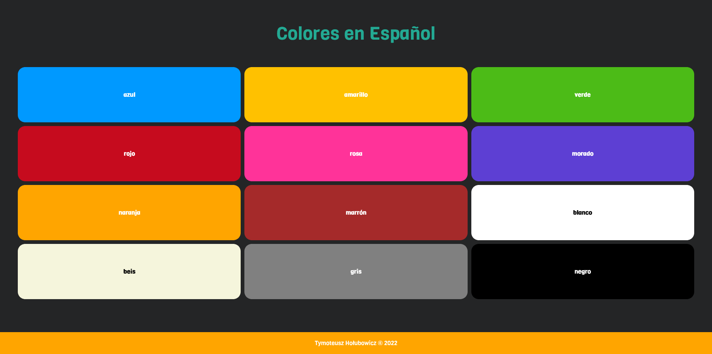
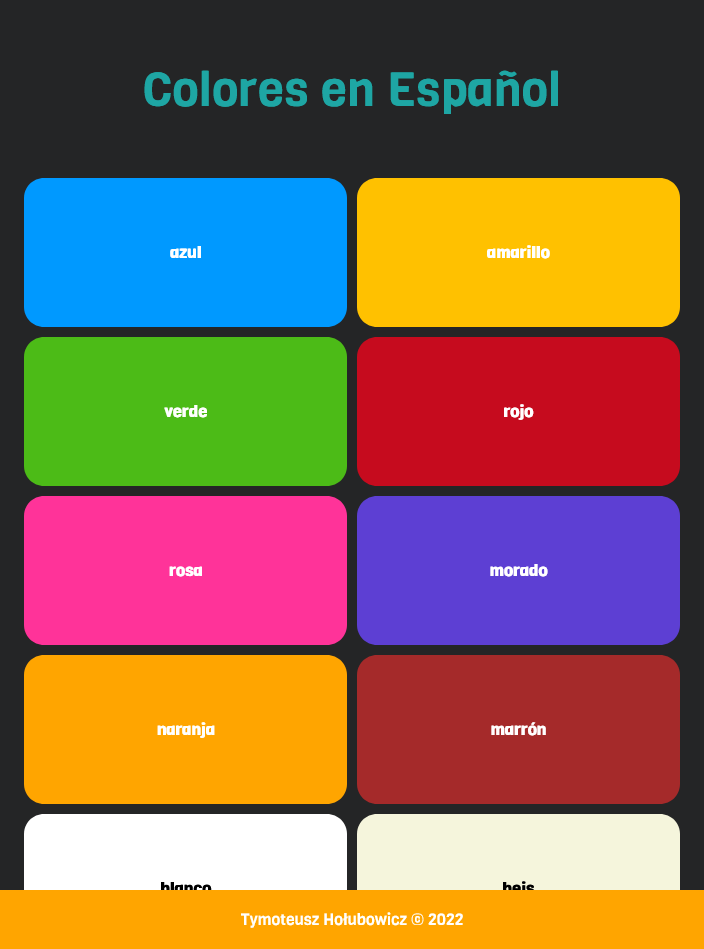
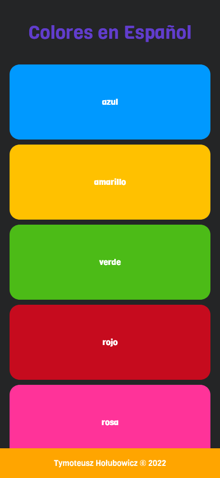

# Colores en Español

[_Colores en Español_][website] is a page that represents colors in Spanish. It's made to learn colors in Spanish.

## Screenshots

<!-- LINKS -->

[website]: https://t-holubowicz.github.io/colores-en-espanol/
