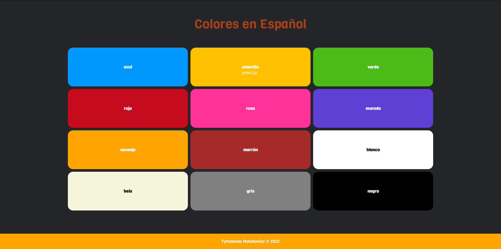

<h1 align="center">
     
    
     
     
    Colores en Español
</h1>

<h4 align="center">
    Page that represents colors in Spanish. It's made to learn colors in Spanish.
</h4>

 

    
    

    
    

  <a href="#usage">Usage</a> •
  <a href="#requirements">Requirements</a> •
  <a href="#download-website">Download website</a> •
  <a href="#license">License</a>

## Usage

Visit [Colores en Español website](https://t-holubowicz.github.io/colores-en-espanol/)

## Requirements

- git
- Node
  - optionally Yarn

## Download website

1. Clone the repository by `git clone https://github.com/t-holubowicz/colores-en-espanol.git`
2. Go into the directory `cd colores-en-espanol/`
3. Install necessary packages `yarn install` or `npm i`

## License

MIT
